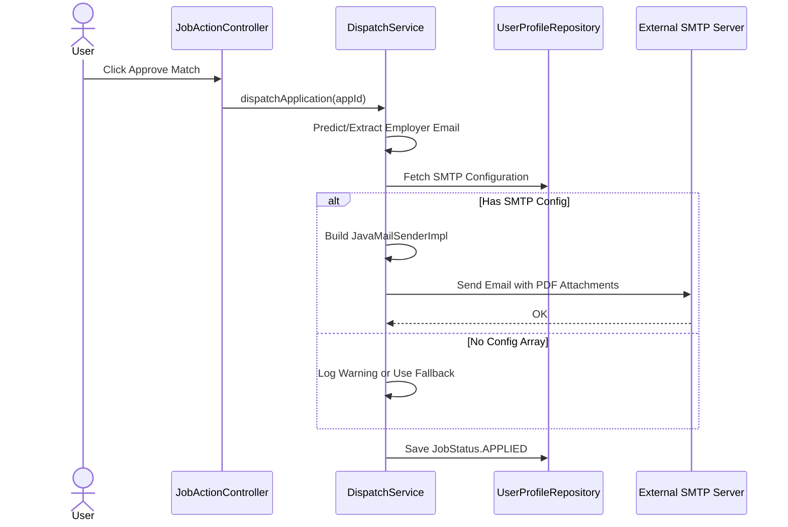

# HireOps Engine Architecture

## Overview

HireOps Engine automates the ingestion of job postings, matches them against a candidate profile using a local Large Language Model, and systematically generates application materials.

The system is designed as a self-hosted monolithic application based on Java 25, Spring Boot 3, and Spring AI.

## Architecture and Technology Stack

* Core Framework: Java 25 and Spring Boot 3.4
* Database: PostgreSQL for production, H2 for testing
* Migrations: FlywayDB
* AI Integration: Spring AI with locally hosted Ollama Llama3
* Frontend: Thymeleaf with Tailwind CSS
* Document Generation: Flexmark and OpenHTMLToPDF
* Email Dispatch: JavaMailSender

## 1. System Components

### 1.1 Ingestion Engine (JobPostingBatch)

A Spring Batch scheduled job that periodically fetches new IT job postings from external APIs.

* Filters jobs by the user's configured searchKeyword.
* Persists raw job data into the JobPosting entity table.

### 1.2 AI Matchmaker (OllamaMatchmakerService)

Evaluates the fit between the candidate's CV and the job description.

* Connects to a local Ollama instance supporting multiple dynamic models (llama3.1, mistral, gemma2, phi3).
* Features programmatic auto-pulling via Ollama API to instantly download missing models.
* Managed by a persistent DB-backed worker queue (`JobQueueScheduler`) for zero-loss, sequential job processing.
* Uses a standard ObjectMapper to gracefully parse the LLM reply into JSON containing a match score, an analysis array, and a German cover letter in Markdown.
* Contains a circuit breaker and fallback mechanism to handle LLM load failures safely.

### 1.3 Application and PDF Engine (PdfGenerationService)

Listens for ApplicationScoredEvents.

* Converts the Markdown cover letter to HTML via Flexmark.
* Renders the HTML to a PDF document using OpenHTMLToPDF.
* Saves the generated files locally and links them to the Application record.

### 1.4 Dynamic Dispatch (DispatchService)

Handles the final step of the pipeline.

* Reads SMTP configuration dynamically from the UserProfile database table.
* Heuristically predicts or uses explicitly provided employer email addresses.
* Instantiates a JavaMailSenderImpl.
* Dispatches an email with the CV and the generated Cover Letter attached directly to the employer.

## 2. Sequence Diagrams

### 2.1 AI Matchmaking Flow

```mermaid
sequenceDiagram
    actor User
    participant Controller as JobActionController
    participant Matchmaker as OllamaMatchmakerService
    participant LLM as Ollama Llama 3
    participant PDF as PdfGenerationService
    participant DB as Database

    User->>Controller: Click Run AI Match on Job
    Controller->>DB: Enqueue Job (ProcessingStatus = QUEUED)
    loop DB-Backed Queue Worker
        Matchmaker->>DB: Poll for QUEUED Jobs
        Matchmaker->>Matchmaker: ensureModelExists (Auto-Pull if missing)
        Matchmaker->>DB: getProfile (Fetch CV and Prompt)
    Matchmaker->>LLM: prompt (Job Description + CV Data)
    LLM-->>Matchmaker: Return Score and Markdown Cover Letter
    Matchmaker->>DB: Save JobStatus.SCORED
    Matchmaker->>PDF: publish ApplicationScoredEvent
    PDF->>PDF: Convert Markdown to HTML
    PDF->>PDF: Generate CoverLetter.pdf
    PDF->>DB: Save Application
```

### 2.2 Application Dispatch Flow



## 3. Database Schema Highlights

* JobPosting: Stores crawled jobs like title, company, description, status.
* UserProfile: A centralized settings table storing the user name, search keywords, default system prompt, email signature, and dynamic SMTP credentials.
* ResumePersona: Stores different applicant profiles or roles linked to a UserProfile, containing a specific cv_pdf_path and system_prompt_override.
* Application: A join entity linking a JobPosting to the generated artifacts.
